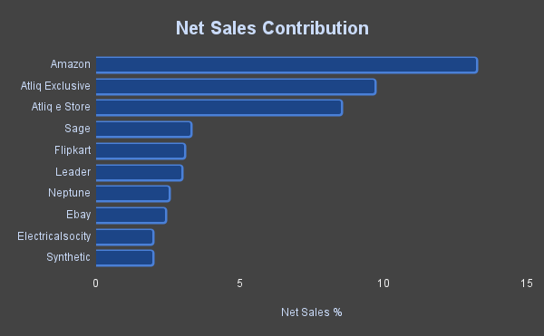
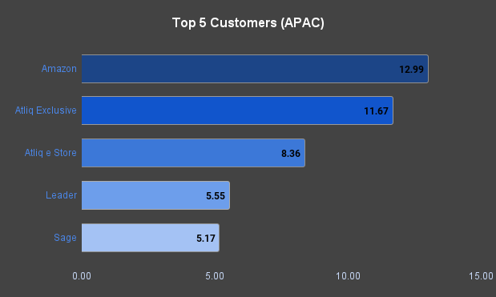
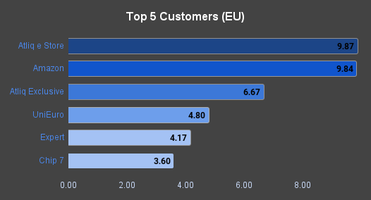
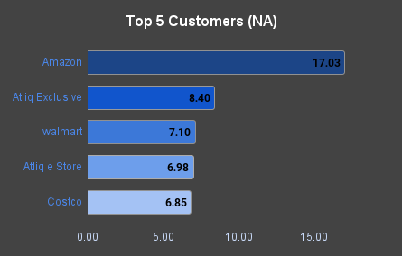
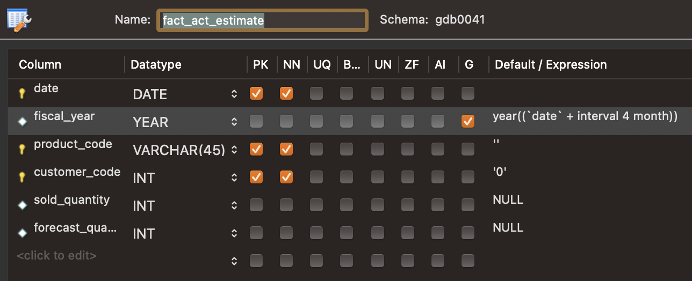
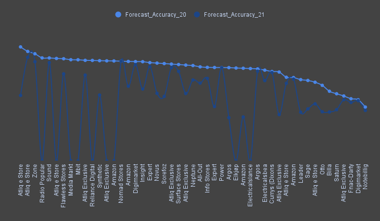

# SQLytics: Ad-hoc Discovery, Instant Insights!

**Data Nerds!** 👋 Ready to dive into the world of **hardware industry insights**? Buckle up, because **SQLytics** is here to uncover hidden gems in Customers, Products & Markets, as well as **Financial** and **Supply Chain** data! 💡

🔍 Curious how SQL powers it all? Head over to the different sections ([Finance](/1_Finance/), [Top Performers](/2_Top_Performers/), [Supply Chain](/3_Supply_Chain/)) and watch the magic unfold!

# Table of Contents
1. [Project Overview](#project-overview)
2. [Tools & Technologies](#tools--technologies)
3. [Approach](#approach)
4. [The Analysis](#the-analysis)
5. [What I Learned](#what-i-learned)
6. [Insights](#insights)
7. [Conclusion](#conclusion)


## Project Overview 

In this project, I'll embark on an exciting journey to unlock the potential of the hardware industry using SQL. Why? Because every piece of data tells a story, and it’s time we bring those stories to light 💡.
With **SQLytics**, we dive into **Finance Analysis**, **Top Performers Analysis**, and **Supply Chain Analysis** to unearth valuable insights that drive strategic decisions. This approach helps identify growth opportunities, optimize supply chains, and enhance overall business performance.

## Tools & Technologies 
For this deep dive into hardware industry insights, I wielded some essential tools:

- **SQL**: My trusty sidekick, diving deep to fetch insights from finance, customers, markets, and supply chain data! 🕵️‍♂️
- **MySQL**: The powerhouse behind my data, handling the heavy lifting like a champ! 💪
- **Visual Studio Code**: My coding playground where SQL magic happens! 🎩✨
- **Git & GitHub**: The ultimate teamwork duo, keeping my scripts organized and ready for collaboration! 🤝
## Approach
Before we begin our analysis, let's explore some key concepts that will enhance our understanding of the business and assist us in our analysis. This overview will cover both business and SQL concepts essential for our project.

What is **RDBMS**?

A **relational database** organizes data into tables linked by common attributes for efficient retrieval. In our project, we will use a **MySQL** database with various tables to analyze key insights.

What is **ETL**?
	
**ETL** stands for Extract, Transform, Load. It’s a process used to gather data from various sources, transform it into a usable format, and load it into a data storage system, like a data warehouse.

What is a **Data** **Warehouse**?

A **Data Warehouse** is a centralized repository that stores large amounts of structured data from different sources. It’s designed for analysis and reporting, allowing businesses to make informed decisions based on historical data.

What are **OLAP** and **OLTP**? Differences between the two.

**OLAP** (Online Analytical Processing) is used for complex queries and data analysis, typically for reporting purposes.
- **OLAP**: Focuses on analysis and reporting; data is read-heavy.

**OLTP** (Online Transaction Processing) handles daily transactions and real-time data entry.
- **OLTP**: Focuses on transaction processing; data is write-heavy.

What is a **Data Catalog**?

A **Data Catalog** is an organized inventory of data assets in an organization. It helps users discover, understand, and manage data by providing information about data sources, their location, and how to access them.

What do **Software Engineers**, **Data Engineers**, **Data Analysts**, and **Data Scientists** do?
- **Software Engineers**: Design and develop software applications.
- **Data Engineers**: Build and maintain data pipelines and architectures.
- **Data Analysts**: Analyze and interpret data to help make business decisions.
- **Data Scientists**: Use advanced analytics and machine learning to extract insights and predict future trends.

**Fact** vs. **Dimension** Tables
- **Fact Tables** store quantitative data for analysis, containing metrics related to business processes (e.g., sales revenue).
- **Dimension Tables** provide context to the facts, containing descriptive attributes (e.g., product names, customer demographics).

**Star** vs. **Snowflake** Schema
- **Star Schema** features a central fact table linked directly to multiple dimension tables, offering simplicity and optimized query performance.
- **Snowflake Schema** normalizes dimension tables into related tables, reducing redundancy but increasing complexity in queries.

What is **P&L**?

**P&L (Profit and Loss)** is a financial statement that summarizes revenues and expenses over a specific period to determine profit or loss.

What is a **Fiscal** Year?

A **Fiscal Year** is a 12-month period for financial reporting that may differ from the calendar year, used for budgeting and performance tracking.

What is **Forecast** Accuracy?

**Forecast Accuracy** measures how well predictions of future performance match actual outcomes, reflecting the effectiveness of forecasting methods.

## The Analysis 
Now that our key concepts are covered, let's dive into the SQL world by creating a database and loading the data. I’ll explore the data and craft SQL queries to investigate specific aspects of the business organization. Here’s how I approached each section.

## Finance Analysis 
### Business Knowledge
**Financial Analysis** is a critical component of understanding a company’s performance, summarizing revenues, costs, and expenses over a specific period to assess profitability. A key element of this analysis is the **Profit and Loss (P&L)** statement, which provides insights into a company's financial performance. By examining P&L statements, we can evaluate profitability, identify trends, and inform strategic decision-making. In this section, we will delve into key financial metrics, including gross price, net sales, cost of goods sold (COGS), and gross margin, uncovering insights into the overall financial health and operational efficiency of the business.
For more details checkout my detailed [P&L Playbook Article](https://digitndreams.hashnode.dev/the-pl-playbook-your-essential-guide-to-financial-metrics)

---
### **Task-1**
Generate a report of individual product sales (aggregated on a monthly basis at the product code level) for Croma India customer for **FY=2021**. The report should have the following fields:
*Month*, *Product Name*, *Variant*, *Sold Quantity*, *Gross Price-Per Item*, *Gross Price Total*

We currently have our data organized by Calendar Year, but we need to pull results for the Fiscal Year (FY). Since our company's Fiscal Year kicks off in September, we'll need to convert the Calendar Year into Fiscal Year format.
As I consider the project ahead, it’s clear we’ll require this Fiscal Year reference for various queries. So, why not take it a step further and create a User Defined Function for the Fiscal Year? We can do the same for Quarters!

Let's go ahead and create two user-defined functions:One for Fiscal Years and another for Fiscal Quarters.
```sql
CREATE DEFINER=`root`@`localhost` FUNCTION `get_fiscal_year`(
	calendar_date DATE
) RETURNS int
    DETERMINISTIC
BEGIN
	DECLARE fiscal_year INT;
    SET fiscal_year = YEAR(DATE_ADD(calendar_date, INTERVAL 4 MONTH));
	RETURN fiscal_year;
END
```

```sql
CREATE DEFINER=`root`@`localhost` FUNCTION `get_fiscal_quarter`(
	calendar_date date
) RETURNS char(2) CHARSET utf8mb4
    DETERMINISTIC
BEGIN
	DECLARE m TINYINT;
    DECLARE qtr CHAR(2);
    SET m = month(calendar_date);
	CASE
		WHEN m in (9,10,11) THEN
			SET qtr = 'Q1';
		WHEN m in (12,1,2) THEN
			SET qtr = 'Q2';
		WHEN m in (2,3,4) THEN
			SET qtr = 'Q3';
		ELSE
			SET qtr = 'Q4';
	END CASE;
RETURN qtr;
END
```

It’s time to put our User Defined Functions to work and craft our query!
```sql
/*
Generate a report of individual product sales (aggregated on a monthly basis at the product code level)
for Croma India customer for FY =2021.
The report should have the following fields,
	1. Month
	2. Product Name
	3. Variant
	4. Sold Quantity
	5. Gross Price Per Item
	6. Gross Price Total
*/

SELECT s.date AS Date,
	s.product_code AS Product_Code,
	p.product AS Product_Name,
	p.variant AS Variant
	s.sold_quantity AS Quantity
ROUND(g.gross_price, 2) AS Gross_Price_Per_Item
ROUND(g.gross_price * s.sold_quantity, 2) AS Gross_Price_Tota
FROM fact_sales_monthly 
	JOIN dim_product p ON s.product_code = p.product_code -- Performed a Join to pull Product Name and Variant
	JOIN fact_gross_price g ON g.product_code = s.product_code -- Performed a Join to pull the Gross Price details
	AND g.fiscal_year = get_fiscal_year(s.date
WHERE customer_code = 90002002
	AND get_fiscal_year(DATE) = 2021
ORDER BY Gross_Price_Total DESC
LIMIT 25;
-- We can now export the Results in a .csv file and present the insights for Croma in FY=2021
```
---

### Task-2
Develop a monthly aggregate gross sales report for Croma Customer to monitor their sales contributions and effectively manage our relationship.
Report Fields: Month & Total Gross Sales Amount to Croma for the Month
```sql
SELECT s.date,
    ROUND(SUM(s.sold_quantity * g.gross_price),2) AS Total_Gross_Sales
FROM fact_sales_monthly s
    JOIN fact_gross_price g ON g.product_code = s.product_code
    AND g.fiscal_year = get_fiscal_year(s.date)
WHERE customer_code = 90002002
GROUP BY s.date
ORDER BY Total_Gross_Sales DESC
LIMIT 10;
```

| Sales Date  | Total Gross Sales |
|-------------|-------------------|
| 2021-12-01  | 19,537,146.56     |
| 2021-10-01  | 13,908,229.29     |
| 2021-09-01  | 11,192,823.08     |
| 2020-12-01  | 4,078,789.92      |
| 2020-10-01  | 3,109,316.88      |
| 2021-02-01  | 2,355,170.45      |
| 2021-08-01  | 2,349,478.82      |
| 2021-01-01  | 2,303,086.37      |
| 2020-09-01  | 2,296,919.63      |
| 2021-06-01  | 2,288,587.45      |


---
### Task-3
Generate a yearly report for Croma. Report Fields: Fiscal Year & Total Gross Sales amount In that year from Croma
```sql
SELECT YEAR(s.date) as Year,
    ROUND(SUM(s.sold_quantity * g.gross_price),2) AS Total_Gross_Sales
FROM fact_sales_monthly s
JOIN fact_gross_price g ON s.product_code = g.product_code AND get_fiscal_year(s.date)=g.fiscal_year
WHERE customer_code = 90002002
GROUP BY YEAR(s.date)
ORDER BY Year
LIMIT 10;
```

| Year | Total Gross Sales |
|------|-------------------|
| 2017 | 530,768.93        |
| 2018 | 2,231,172.50      |
| 2019 | 5,506,281.69      |
| 2020 | 12,598,161.69     |
| 2021 | 58,369,684.71     |

Insights
- **Significant Growth**: Gross sales showed remarkable growth, especially from 2020 to 2021, increasing from $12.6 million to over $58 million.
- **Yearly Increase**: Each year experienced substantial growth, with 2018 seeing a notable increase from 2017.
- **Long-Term Trends**: The data indicates a strong upward trend in sales, highlighting effective strategies and market expansion.
>###### Bonus
Picture this: you're deep into a project, and the client is constantly requesting gross sales reports for various customers. It feels like there's a new data extraction request every day! Instead of repeating this manual process, why not work smarter?

Let’s develop a Stored Procedure to automate the retrieval of gross sales data for different customers. This will streamline our workflow, save valuable time, and impress the client with swift and efficient reporting.
```sql
CREATE DEFINER=`root`@`localhost` PROCEDURE `get_monthly_gross_sales_for_customer`(
	c_code INT
)
BEGIN
SELECT s.date,
    ROUND(SUM(s.sold_quantity * g.gross_price),2) AS Total_Gross_Sales
FROM fact_sales_monthly s
    JOIN fact_gross_price g ON g.product_code = s.product_code
    AND g.fiscal_year = get_fiscal_year(s.date)
WHERE customer_code = c_code
GROUP BY s.date;
END
```
---
### Task-4
Create a stored procedure that assigns a market badge based on the following criteria:
If the total sold quantity exceeds 5 million, the market badge is **Gold**; otherwise, it is **Silver**.
	*Inputs*: Market - Fiscal Year
	*Output*: Market Badge
```sql
CREATE DEFINER=`root`@`localhost` PROCEDURE `get_market_badge`(
	IN in_market VARCHAR(20),
    IN in_fiscal_year YEAR,
    OUT out_badge VARCHAR(15)
)
BEGIN
	DECLARE qty INT DEFAULT 0;
    
    -- Setting Default market if no input is provided.
    IF in_market = "" THEN
		SET in_market = "India";
	END IF;
    
	-- Retrieve total quantity for a given country/market + Fiscal Year
	SELECT SUM(sold_quantity) INTO qty
	FROM fact_sales_monthly s
		JOIN dim_customer c ON s.customer_code = c.customer_code
	WHERE get_fiscal_year(s.date) = in_fiscal_year
		AND c.market = in_market
	GROUP BY c.market;
    
	-- Assign Market Badge (Gold or Silver)
	IF qty > 5000000 THEN
		SET out_badge = "Gold";
	ELSE
		SET out_badge = "Silver";
	END IF;
END
```

Time to Wrap Up Our Finance Section with Five Key Benefits of Stored Procedures:
1. **Performance:** Precompiled execution leads to faster query processing.
2. **Efficiency:** Reduces network traffic by bundling SQL statements.
3. **Security:** Limits direct access to data, enhancing security.
4. **Reusability:** Promotes code reuse across applications.
5. **Encapsulation:** Centralizes complex business logic within the database for consistency.
---
## Top Performers Analysis (Key Customers, Products & Markets)

### Task-1
Generate a report for the top **Markets**, **Products**, and **Customers** based on **Net Sales(Revenue)** for a given **Financial Year**. This will provide a comprehensive overview of our financial performance, enabling us to take appropriate measures to address any potential losses.

When I began crafting the query for net sales, I first pulled the **pre-invoice discount** into the main output. However, even before diving into the net sales (revenue) analysis, I noticed that the query was taking a significant amount of time to load. And this was while only fetching 1,000 records out of the entire dataset. Given the performance issue, it seems like an ideal time to consider optimizing the query. Let's work on streamlining it for better efficiency.

>#### Approach 1
I'll Start by using the`EXPLAIN ANALYZE`
```
-> Limit: 1000000 row(s)  (cost=194235 rows=430988) (actual time=22.7..4509 rows=608108 loops=1)
    -> Nested loop inner join  (cost=194235 rows=430988) (actual time=22.7..4474 rows=608108 loops=1)
        -> Nested loop inner join  (cost=43389 rows=430988) (actual time=22.6..3656 rows=608108 loops=1)
            -> Nested loop inner join  (cost=161 rows=118) (actual time=0.203..1.6 rows=334 loops=1)
                -> Filter: (g.fiscal_year = 2021)  (cost=119 rows=118) (actual time=0.106..0.567 rows=334 loops=1)
                    -> Table scan on g  (cost=119 rows=1182) (actual time=0.101..0.457 rows=1182 loops=1)
                -> Single-row index lookup on p using PRIMARY (product_code=g.product_code)  (cost=0.251 rows=1) (actual time=0.0029..0.00293 rows=1 loops=334)
            -> Filter: (get_fiscal_year(s.`date`) = 2021)  (cost=4.18 rows=3646) (actual time=4.34..10.8 rows=1821 loops=334)
                -> Index lookup on s using PRIMARY (product_code=g.product_code)  (cost=4.18 rows=3646) (actual time=0.025..1.25 rows=4082 loops=334)
        -> Single-row index lookup on pid using PRIMARY (customer_code=s.customer_code, fiscal_year=2021)  (cost=0.25 rows=1) (actual time=0.00117..0.0012 rows=1 loops=608108)
```

It looks like our current filter is calling the stored procedure for the fiscal year calculation on every row—over 1.5 million rows. This is inefficient, especially since many of the values are repetitive.

A potential solution would be to create a separate `dim_date` table that contains both `calendar_date` and `fiscal_year`. The `fiscal_year` could be a generated column, using `YEAR(DATE_ADD(calendar_date, INTERVAL 4 MONTH))`. We can populate the calendar dates in this table via an Excel import. This would eliminate the need for recalculating the fiscal year for each row during the query.
```sql
SELECT
    s.date
    s.product_code
    p.product
    p.variant
    s.sold_quantity
    ROUND(g.gross_price, 2) AS gross_price_per_item,
    ROUND(g.gross_price * s.sold_quantity, 2) AS gross_price_total,
    pid.pre_invoice_discount_pct
FROM
    fact_sales_monthly s
    JOIN dim_product p 
	    ON s.product_code = p.product_code
    JOIN dim_date d 
	    ON d.calendar_date = s.date
    JOIN fact_gross_price g 
	    ON g.product_code = s.product_code
	    AND g.fiscal_year = d.fiscal_year
    JOIN fact_pre_invoice_deductions pid 
	    ON s.customer_code = pid.customer_code
	    AND d.fiscal_year = pid.fiscal_year
WHERE
    d.fiscal_year = 2021
LIMIT 1000000;
```

If you run `EXPLAIN ANALYZE` on the query above, you'll see that the time taken for the filter execution step has nearly been cut in half.

>#### Approach 2
Another way to enhance performance is to directly add the `fiscal_year` column to the `fact_sales` table rather than creating a separate `dim_date` table. I can modify the `fact_sales_monthly` table by adding a new generated column called `fiscal_year`, which can be defined using the expression `YEAR(DATE_ADD(date, INTERVAL 4 MONTH))`

After implementing those changes, I can use the `fiscal_year` directly from `fact_sales_monthly` table:
```sql
SELECT
    s.date
    s.product_code
    p.product
    p.variant
    s.sold_quantity
    ROUND(g.gross_price, 2) AS gross_price_per_item,
    ROUND(g.gross_price * s.sold_quantity, 2) AS Gross_Price_Total,
    pid.pre_invoice_discount_pct
FROM
    fact_sales_monthly s
    JOIN dim_product p ON s.product_code = p.product_code
    JOIN fact_gross_price g ON g.product_code = s.product_code
    AND g.fiscal_year = s.fiscal_year
    JOIN fact_pre_invoice_deductions pid ON s.customer_code = pid.customer_code
    AND s.fiscal_year = pid.fiscal_year
WHERE
    s.fiscal_year = 2021
```

Let’s keep going—our final stop is net sales, remember.

I’ll create a database view to store our **Pre-Invoice Discount** data.
```sql
-- Creating a View sales_preinvoice_discount
CREATE VIEW sales_preinvoice_discount AS
        SELECT
            s.date,
            s.fiscal_year,
            s.customer_code,
            c.market,
            s.product_code,
            p.product,
            p.variant,
            s.sold_quantity,
            ROUND(g.gross_price, 2) AS gross_price_per_item,
            ROUND(g.gross_price * s.sold_quantity, 2) AS gross_price_total,
            pid.pre_invoice_discount_pct
        FROM
            fact_sales_monthly s
            JOIN dim_customer c 
                ON c.customer_code = s.customer_code
            JOIN dim_product p 
                ON s.product_code = p.product_code
            JOIN dim_date d 
                ON d.calendar_date = s.date
            JOIN fact_gross_price g 
                ON g.product_code = s.product_code
                AND g.fiscal_year = d.fiscal_year
            JOIN fact_pre_invoice_deductions pid 
                ON s.customer_code = pid.customer_code
                AND d.fiscal_year = pid.fiscal_year
        WHERE
            d.fiscal_year = 2021
```

Another Database view for **Post-Invoice Discount**
```sql
CREATE VIEW
    sales_postinvoice_discount AS
SELECT
    s.date,
    s.fiscal_year,
    s.customer_code,
    s.market,
    s.product_code,
    s.product,
    s.variant,
    s.sold_quantity,
    s.gross_price_total,
    s.pre_invoice_discount_pct,
    (s.gross_price_total - s.pre_invoice_discount_pct * s.gross_price_total) as net_invoice_sales,
    (pod.discounts_pct + pod.other_deductions_pct) as post_invoice_discount_pct
FROM
    sales_preinvoice_discount s
    JOIN fact_post_invoice_deductions pod
        ON s.customer_code = pod.customer_code
        AND s.product_code = pod.product_code
        AND s.date = pod.date
```

Our final destination: **Net Sales**.
```sql
CREATE VIEW `net_sales` AS
SELECT
    *,
    net_invoice_sales *(1-post_invoice_discount_pct) as net_sales
FROM sales_postinvoice_discount;
```

Bonus View for **Gross Sales**
```sql
CREATE VIEW
    `gross_sales` AS
SELECT
    s.date,
    s.fiscal_year,
    s.customer_code,
    c.customer,
    s.market,
    s.product_code,
    s.product,
    s.variant,
    s.sold_quantity,
    s.gross_price_per_item,
    s.gross_price_total
FROM
    sales_preinvoice_discount s
    JOIN dim_customer c 
        ON c.customer_code = s.customer_code
```

#### Let’s dive into the insights on our Top Performers!

**Top Markets**
```sql
-- Top Markets
SELECT
    market,
    ROUND(SUM(net_sales)/1000000,2) AS Net_Sales_in_Millions
FROM net_sales
WHERE fiscal_year = 2022
GROUP BY market
ORDER BY Net_Sales_in_Millions DESC
LIMIT 5;
```

| **Market**     | **Net Sales (in millions)** |
| -------------- | --------------------------- |
| India          | 445.25                      |
| USA            | 288.90                      |
| South Korea    | 121.83                      |
| Canada         | 103.20                      |
| United Kingdom | 73.52                       |

Key Findings
- **Top Market**: India leads with net sales of $445.25 million, followed by the USA at $288.90 million.
- **Moderate Performers**: South Korea and Canada exhibited moderate sales, while the UK struggled.
- **Growth Strategies**: Enhancing strategies in the USA and APAC, along with addressing European challenges, can drive overall growth.

**Top Customers**
```sql
-- Top Customers
SELECT
    c.customer,
    ROUND(SUM(net_sales)/1000000,2) AS Net_Sales_in_Millions
FROM net_sales s
JOIN dim_customer c ON c.customer_code = s.customer_code
WHERE fiscal_year = 2022
GROUP BY c.customer
ORDER BY Net_Sales_in_Millions DESC
LIMIT 5;
```

| **Customer**    | **Net Sales (in millions)** |
| --------------- | --------------------------- |
| Amazon          | 218.21                      |
| Atliq Exclusive | 159.31                      |
| Atliq e Store   | 133.08                      |
| Flipkart        | 57.24                       |
| Sage            | 52.49                       |

Key Findings
- **Top Performer**: Amazon leads with $218.21 million in net sales.
- **Strong Contenders**: AtliQ Exclusive and AtliQ e Store follow closely.
- **Growth Opportunities**: Flipkart and Sage recorded lower sales; focusing on key accounts while expanding growth with smaller customers can enhance overall performance.

**Top Products**
```sql
-- Top Products
SELECT 
    product,
    ROUND(SUM(net_sales)/1000000,2) AS Net_Sales_in_Millions
FROM net_sales
WHERE fiscal_year = 2022
GROUP BY product
ORDER BY Net_Sales_in_Millions DESC
LIMIT 5;
```

| **Product**                          | **Net Sales (in millions)** |
| ------------------------------------ | --------------------------- |
| AQ BZ Allin1 Gen 2                   | 84.63                       |
| AQ HOME Allin1 Gen 2                 | 78.84                       |
| AQ Smash 2                           | 73.55                       |
| AQ Smash 1                           | 67.98                       |
| AQ Electron 3 3600 Desktop Processor | 65.65                       |

Insights:
- **Top Seller**: AQ BZ Allin1 Gen 2 leads with $84.63 million in sales.
- **Strong Contenders**: AQ HOME Allin1 Gen 2 and AQ Smash 2 follow closely with $78.84 million and $73.55 million, respectively.
- **Opportunities for Growth**: AQ Smash 1 and AQ Electron 3 3600, with sales of $67.98 million and $65.65 million, can improve through targeted marketing efforts.

We conducted an analysis of our top performers for FY 2022. However, the task assigned was to create a stored procedure to streamline this process for future use cases. This stored procedure should allow users to quickly query and retrieve top markets for a given year, with flexibility to view top 10 or top 20 markets. Additionally, it should enable users to filter and view top products within a specific market and year.

Stored Procedure to Retrieve the Top **n** Markets.
```sql
CREATE PROCEDURE `get_top_n_markets_by_net_sales` (
	in_fiscal_year INT,
    in_top_n INT  
)
BEGIN
	SELECT
		market,
		ROUND(SUM(net_sales)/1000000,2) AS Net_Sales_in_Millions
	FROM net_sales
	WHERE fiscal_year = in_fiscal_year
	GROUP BY market
	ORDER BY Net_Sales_in_Millions DESC
	LIMIT in_top_n;
END
```

Stored Procedure to Retrieve the Top **n** Customers.
```sql
CREATE PROCEDURE `get_top_n_customers_by_net_sales` (
	in_market VARCHAR(45),
    in_fiscal_year INT,
    in_top_n INT  
)
BEGIN
	SELECT
    c.customer,
    ROUND(SUM(net_sales)/1000000,2) AS Net_Sales_in_Millions
	FROM net_sales s
	JOIN dim_customer c 
		ON c.customer_code = s.customer_code
	WHERE fiscal_year = in_fiscal_year
		AND s.market = in_market
	GROUP BY c.customer
	ORDER BY Net_Sales_in_Millions DESC
	LIMIT in_top_n;
END
```

Stored Procedure to Retrieve the Top **n** Products.
```sql
CREATE PROCEDURE `get_top_n_products_by_net_sales` (
	in_market VARCHAR(45),
    in_fiscal_year INT,
    in_top_n INT  
)
BEGIN
	SELECT
    product,
    ROUND(SUM(net_sales)/1000000,2) AS Net_Sales_in_Millions
	FROM net_sales s
	WHERE fiscal_year = in_fiscal_year
		AND s.market = in_market
	GROUP BY product
	ORDER BY Net_Sales_in_Millions DESC
	LIMIT in_top_n;
END
```
---
### Task-2
Create a bar chart report for FY 2021, showcasing the top 10 markets by *percentage*(%) of **Net Sales**.
```sql
WITH cte1 AS(
    SELECT
    c.customer,
    ROUND(SUM(net_sales)/1000000,2) AS Net_Sales_in_Millions
    FROM net_sales s
    JOIN dim_customer c ON c.customer_code = s.customer_code
    WHERE fiscal_year = 2021
    GROUP BY c.customer
)
SELECT 
    *,
    Net_Sales_in_Millions*100/SUM(Net_Sales_in_Millions) OVER() AS NS_pct
FROM cte1
ORDER BY Net_Sales_in_Millions DESC
LIMIT 10;
```



---
### Task-3
Develop a bar/pie chart report for FY 2021 to analyze the company’s performance, displaying the percentage breakdown of net sales by customers across regions (e.g., APAC, EU, NA)
```sql
WITH cte1 AS(
    SELECT
        c.customer,
        c.region,
        ROUND(SUM(net_sales)/1000000,2) AS Net_Sales_in_Millions
    FROM net_sales ns
    JOIN dim_customer c 
        ON c.customer_code=ns.customer_code
    WHERE fiscal_year = 2021
    GROUP BY c.customer,c.region
)
SELECT 
    *,
    Net_Sales_in_Millions*100/SUM(Net_Sales_in_Millions) OVER(PARTITION BY region) AS NS_pct
FROM cte1
ORDER BY region, Net_Sales_in_Millions DESC;
```

Add images from assets




---
### Task-4
Create a stored procedure to retrieve the top **n** products by quantity sold within each division for a specified financial year.
```sql
WITH cte1 AS (
    SELECT
        p.division,
        p.product,
        SUM(s.sold_quantity) AS total_qty
    FROM fact_sales_monthly s
    JOIN dim_product p
        ON p.product_code = s.product_code
    WHERE s.fiscal_year = 2021
    GROUP BY p.division, p.product
),
cte2 AS (
    SELECT
        *,
        DENSE_RANK() OVER (PARTITION BY division ORDER BY total_qty DESC) AS drnk
    FROM cte1
)
SELECT * 
FROM cte2 
WHERE drnk <= 3;
```

| Division | Product Name         | Total Quantity | Dense_RNK |
| -------- | -------------------- | -------------- | --------- |
| N&S      | AQ Pen Drive DRC     | 2,034,569      | 1         |
| N&S      | AQ Digit SSD         | 1,240,149      | 2         |
| N&S      | AQ Clx1              | 1,238,683      | 3         |
| P&A      | AQ Gamers Ms         | 2,477,098      | 1         |
| P&A      | AQ Maxima Ms         | 2,461,991      | 2         |
| P&A      | AQ Master wireless x | 2,448,784      | 3         |
| PC       | AQ Digit             | 135,092        | 1         |
| PC       | AQ Gen Y             | 135,031        | 2         |
| PC       | AQ Elite             | 134,431        | 3         |

Insights
- **Top Performers**: AQ Pen Drive DRC leads in N&S with 2,034,569 units, while AQ Gamers Ms tops P&A with 2,477,098 units.
- **Low Sales**: The PC division lags behind, with AQ Digit selling only 135,092 units.
- **Action Plan**: Capitalize on strengths in N&S and P&A, while enhancing marketing efforts for PC products.

Stored Procedure to retrieve Top **n** Products per Division by Quantity Sold
```sql
CREATE PROCEDURE `get_top_n_products_per_division_by_qty_sold` (
	in_fiscal_year INT,
    in_top_n INT
)
BEGIN
	WITH cte1 AS (
    SELECT
        p.division,
        p.product,
        SUM(s.sold_quantity) AS total_qty
    FROM fact_sales_monthly s
    JOIN dim_product p
        ON p.product_code = s.product_code
    WHERE s.fiscal_year = in_fiscal_year
    GROUP BY p.division, p.product
),
	cte2 AS (
		SELECT
			*,
			DENSE_RANK() OVER (PARTITION BY division ORDER BY total_qty DESC) AS drnk
		FROM cte1
)
	SELECT * 
	FROM cte2 
	WHERE drnk <= in_top_n;
END
```
---
### Task-5
Retrieve the top 2 markets in each region based on their gross sales amount for the fiscal year 2021.
```sql
WITH cte1 AS (
    SELECT
        c.market,
        c.region,
        ROUND(SUM(s.sold_quantity*g.gross_price)/1000000,2) AS gross_sales_mln
    FROM fact_sales_monthly s
    JOIN fact_gross_price g
        ON s.product_code = g.product_code
        AND s.fiscal_year = g.fiscal_year
    JOIN dim_customer c 
        ON c.customer_code = s.customer_code
    WHERE s.fiscal_year = 2021
    GROUP BY c.market, c.region
),
cte2 AS (
    SELECT
        *,
        DENSE_RANK() OVER (PARTITION BY region ORDER BY gross_sales_mln DESC) AS drnk
    FROM cte1
)
SELECT * 
FROM cte2 
WHERE drnk <= 2;
```

| Market         | Region | Gross Sales (In Millions) | Dense_RNK |
| -------------- | ------ | ------------------------- | --------- |
| India          | APAC   | 455.05                    | 1         |
| South Korea    | APAC   | 131.86                    | 2         |
| United Kingdom | EU     | 78.11                     | 1         |
| France         | EU     | 67.62                     | 2         |
| Mexico         | LATAM  | 2.30                      | 1         |
| Brazil         | LATAM  | 2.14                      | 2         |
| USA            | NA     | 264.46                    | 1         |
| Canada         | NA     | 89.78                     | 2         |

Insights
- **Leading Markets**: India tops APAC with $455.05 million, followed by South Korea; the UK leads the EU at $78.11 million, and Mexico heads LATAM at $2.30 million.
- **Sales Insights**: India demonstrates strong performance, while the UK lags behind APAC figures.
- **Growth Focus**: Target strategies to expand in LATAM and enhance market presence in the EU.

That brings us to the end of our **Top Performers** section!

---
To top it off, let’s see how SQL is leveraged across industries:
1. **Ad-hoc Analysis**: On-the-fly queries to answer business questions and support quick decisions.
2. **Report Generation**: Automating recurring reports for operational, financial, and strategic insights.
3. **Exploratory Data Analysis (EDA) and Machine Learning**: Preparing and analyzing data to uncover insights and power machine learning models.
4. **Inside BI Tools**: Enabling dashboards and reports in tools like Power BI, Tableau, and Looker for visual analytics.
5. **ETL and Data Migration**: Managing data extraction, transformation, loading, and migration for seamless integration.
6. **CRUD Operations**: Performing **Create**, **Read**, **Update**, and **Delete** operations on databases to manage and maintain data efficiently.

---

## Supply Chain Analysis

Our next SQL task will focus on the supply chain. Let’s dive into the fundamentals, as domain knowledge can provide valuable insights and support deeper analysis.
1. **Forecasts:** Predicted future demand based on trends and historical data.
2. **Actuals:** Real-world demand or sales observed over a period.
3. **Net Error:** Difference between forecast and actual values `(Forecast - Actual)`.
4. **Net Error %:** Net Error as a percentage of actual demand `(Net Error /Actual) x 100`.
5. **Absolute Error:** Absolute difference between forecast and actual `|Forecast - Actual|`.
6. **Absolute Error %:** Absolute Error as a percentage of actual demand `(Absolute Error / Actual) x 100`.
7. **Forecast Accuracy:** How close forecasts are to actuals, calculated as `100% - Absolute Error%`.
If you want to dive deeper into the fundamentals of supply chain management, be sure to check out my article, [**Supply Chain Essentials**](https://digitndreams.hashnode.dev/supply-chain-essentials-cracking-the-forecasting-code).

---
### Task-1
Generate an **aggregate forecast accuracy report** for all customers over a given fiscal year to monitor how accurately forecasts align with actual sales. The report will include the following fields:
1. **Customer Code, Name, Market**
2. **Total Sold Quantity**
3. **Total Forecast Quantity**
4. **Net Error**
5. **Absolute Error**
6. **Forecast Accuracy (%)**

I have the `sold_quantity` in the `fact_sales_monthly` table and the `forecast_quantity` in the `fact_forecast_monthly` table. To analyze these quantities, I’ll need to **join both tables**. However, since the number of records in both tables may differ and some fields could contain **NULL values**, we need a strategy to address those discrepancies.
In the real world, you’d typically **consult with your organization’s managers** and collaborate with your team to determine the most appropriate way to handle such **NULL values**.
For this example, I’ll assume that **missing data (NULL values) should be treated as `0`**.

Given these considerations, a **FULL JOIN** using a **UNION** seems like the most appropriate approach to combine the data from both tables. This ensures that **all records from both datasets are included**, even if some have no matching counterparts.

>Create a NEW Table `fact_act_estimates`

```sql
-- Create a NEW Table fact_act_estimates
CREATE Table
    fact_act_estimate (
        SELECT
            s.date AS date,
            s.fiscal_year AS fiscal_year,
            s.customer_code AS customer_code,
            s.product_code AS product_code,
            s.sold_quantity AS sold_quantity,
            f.forecast_quantity AS forecast_quantity
        FROM
            fact_sales_monthly s
            LEFT JOIN fact_forecast_monthly f 
                USING (date, customer_code, product_code)
        UNION
        SELECT
            f.date AS date,
            f.fiscal_year AS fiscal_year,
            f.customer_code AS customer_code,
            f.product_code AS product_code,
            s.sold_quantity AS sold_quantity,
            f.forecast_quantity AS forecast_quantity
        FROM
            fact_forecast_monthly f
            LEFT JOIN fact_sales_monthly s
                USING (date, customer_code, product_code)
);

-- Fixing NULL Values in sold_quantity
UPDATE fact_act_estimate
SET sold_quantity = 0
WHERE sold_quantity IS NULL;

-- Fixing NULL Values in forecast_quantity
UPDATE fact_act_estimate
SET forecast_ quantity = 0
WHERE forecast_quantity IS NULL;

-- Quick Glance
SELECT * FROM fact_act_estimate
LIMIT 10;
```

I'll go to the MySQL Workbench and tweak the table a bit.


Since `fact_act_estimate` is derived from `fact_sales_monthly`, wouldn’t it be great if new records in `fact_sales_monthly` updated `fact_act_estimate automatically`? A **database trigger** can make that happen!

```sql
CREATE DEFINER=`root`@`localhost` TRIGGER `fact_sales_monthly_AFTER_INSERT` AFTER INSERT ON `fact_sales_monthly` FOR EACH ROW BEGIN
	INSERT INTO fact_act_estimate
		(date, product_code, customer_code, sold_quanity)
	VALUES (
        NEW.date,
        NEW.product_code,
        NEW.customer_code,
        NEW.sold_quantity
    ) 
    ON DUPLICATE KEY
		UPDATE sold_quanity = VALUES(sold_quanity);
END

-- You can verify it by
SHOW TRIGGERS
```

We can set up a trigger for ``fact_forecast_monthly`` as well.

```sql
CREATE DEFINER = CURRENT_USER TRIGGER `gdb0041`.`fact_forecast_monthly_AFTER_INSERT` AFTER INSERT ON `fact_forecast_monthly` FOR EACH ROW
BEGIN
	INSERT INTO fact_act_estimate
		(date, product_code, customer_code, forecast_quanity)
	VALUES (
        NEW.date,
        NEW.product_code,
        NEW.customer_code,
        NEW.forecast_quantity
    ) 
    ON DUPLICATE KEY
		UPDATE forecast_quantity = VALUES(forecast_quantity);
END
```

Forecast Accuracy Report for 2021
```sql
WITH forecast_calc AS(
    SELECT
        e.customer_code,
        c.customer AS Customer,
        c.market AS Market,
        SUM(sold_quantity) AS Total_Sold_Quantity,
        SUM(forecast_quantity) AS Total_Forecast_Quantity,
        SUM(forecast_quantity-sold_quantity) AS Net_Error,
        ROUND(SUM(forecast_quantity-sold_quantity)*100 / SUM(forecast_quantity),2) AS Net_Error_pct,
        SUM(ABS(forecast_quantity-sold_quantity)) AS Abs_Error,
        ROUND(SUM(ABS(forecast_quantity-sold_quantity))*100 / SUM(forecast_quantity),2) AS Abs_Error_pct
    FROM fact_act_estimate e
    JOIN dim_customer c
        ON c.customer_code = e.customer_code
    WHERE fiscal_year = 2021
    GROUP BY customer_code
)

SELECT 
    *,
    IF(Abs_Error_pct > 100, 0, ROUND(100-Abs_Error_pct,2)) AS Forecast_Accuracy
FROM forecast_calc
ORDER BY Forecast_Accuracy DESC
LIMIT 5;
```

Top 5 Customer's with Highest Forecast Accuracy

| **Customer Code** | **Customer**      | **Market**    | **Total Sold Quantity** | **Total Forecast Quantity** | **Net Error** | **Net Error %** | **Abs Error** | **Abs Error %** | **Forecast Accuracy** |
|-------------------|-------------------|---------------|-------------------------|-----------------------------|---------------|-----------------|---------------|-----------------|-----------------------|
| 90013120          | Coolblue           | Italy         | 109,547                 | 133,532                     | 23,985        | 17.96%          | 70,467        | 52.77%          | 47.23%                |
| 70010048          | Atliq e Store      | Bangladesh    | 119,439                 | 142,010                     | 22,571        | 15.89%          | 75,711        | 53.31%          | 46.69%                |
| 90023027          | Costco             | Canada        | 236,189                 | 279,962                     | 43,773        | 15.64%          | 149,303       | 53.33%          | 46.67%                |
| 90023026          | Relief             | Canada        | 228,988                 | 273,492                     | 44,504        | 16.27%          | 146,948       | 53.73%          | 46.27%                |
| 90017051          | Forward Stores     | Portugal      | 86,823                  | 118,067                     | 31,244        | 26.46%          | 63,568        | 53.84%          | 46.16%                |

Insights:
- **Forecast Accuracy** across top forecasted customers ranges from **46.16% to 47.23%**, indicating a significant gap between actual sales and forecasted quantities.
- **Net Errors** are higher for larger markets like Canada, where Costco shows a net error of **43,773**, while smaller markets such as Portugal exhibit higher percentage errors (**26.46%** for Forward Stores).
- **Absolute Error** percentages are quite high (above **50%**) across all customers, highlighting challenges in accurate demand forecasting across different regions.

Bottom 5 Customer's with least Forecast Accuracy.

| **Customer Code** | **Customer**          | **Market**      | **Total Sold Quantity** | **Total Forecast Quantity** | **Net Error** | **Net Error %** | **Abs Error** | **Abs Error %** | **Forecast Accuracy** |
|-------------------|-----------------------|-----------------|-------------------------|-----------------------------|---------------|-----------------|---------------|-----------------|-----------------------|
| 90007197          | Amazon                | South Korea     | 344,240                 | 226,857                     | -117,383      | -51.74%         | 191,047       | 84.21%          | 15.79%                |
| 90019202          | Argos (Sainsbury's)    | Sweden          | 26,581                  | 18,218                      | -8,363        | -45.91%         | 15,273        | 83.83%          | 16.17%                |
| 90019203          | Amazon                | Sweden          | 27,550                  | 19,060                      | -8,490        | -44.54%         | 15,928        | 83.57%          | 16.43%                |
| 70007198          | Atliq Exclusive        | South Korea     | 345,667                 | 228,104                     | -117,563      | -51.54%         | 188,585       | 82.68%          | 17.32%                |
| 70007199          | Atliq e Store          | South Korea     | 358,064                 | 236,637                     | -121,427      | -51.31%         | 194,953       | 82.38%          | 17.62%                |

Insights:
- **Forecast Accuracy** for all customers in this set is low, ranging from **15.79% to 17.62%**, with a high absolute error percentage indicating substantial deviation from the forecast.
- Markets in **South Korea** (e.g., Amazon and Atliq) have large **negative net errors** (above **-51%**), signaling significant over-forecasting.
- **Abs Error %** for all customers is above **80%**, reflecting high inaccuracies in forecasted quantities, which would require attention to improve future predictions.

By now, you've likely noticed how much we dislike repetitive tasks. Naturally, we'll store this query in a **stored procedure**—because, why not streamline the process? 

Forecast Accuracy Stored Procedure
```sql
CREATE PROCEDURE `get_forecast_accuracy` (
	in_fiscal_year INT
)
BEGIN
	WITH forecast_calc AS(
    SELECT
        e.customer_code,
        c.customer AS Customer,
        c.market AS Market,
        SUM(sold_quantity) AS Total_Sold_Quantity,
        SUM(forecast_quantity) AS Total_Forecast_Quantity,
        SUM(forecast_quantity-sold_quantity) AS Net_Error,
        ROUND(SUM(forecast_quantity-sold_quantity)*100 / SUM(forecast_quantity),2) AS Net_Error_pct,
        SUM(ABS(forecast_quantity-sold_quantity)) AS Abs_Error,
        ROUND(SUM(ABS(forecast_quantity-sold_quantity))*100 / SUM(forecast_quantity),2) AS Abs_Error_pct
    FROM fact_act_estimate e
    JOIN dim_customer c
        ON c.customer_code = e.customer_code
    WHERE fiscal_year = in_fiscal_year
    GROUP BY customer_code
)

	SELECT 
		*,
		IF(Abs_Error_pct > 100, 0, ROUND(100-Abs_Error_pct,2)) AS Forecast_Accuracy
	FROM forecast_calc
	ORDER BY Forecast_Accuracy DESC;
END
```
---
### Task-2
Write a query for the following scenario:
The supply chain manager needs to identify customers whose forecast accuracy declined from 2020 to 2021. Generate a detailed report with the following columns: customer_code, customer_name, market, forecast_accuracy_2020, forecast_accuracy_2021.
```sql
CREATE temporary TABLE fa_2021
    WITH forecast_calc AS(
        SELECT
            e.customer_code,
            c.customer AS Customer,
            c.market AS Market,
            SUM(sold_quantity) AS Total_Sold_Quantity,
            SUM(forecast_quantity) AS Total_Forecast_Quantity,
            SUM(forecast_quantity-sold_quantity) AS Net_Error,
            ROUND(SUM(forecast_quantity-sold_quantity)*100 / SUM(forecast_quantity),2) AS Net_Error_pct,
            SUM(ABS(forecast_quantity-sold_quantity)) AS Abs_Error,
            ROUND(SUM(ABS(forecast_quantity-sold_quantity))*100 / SUM(forecast_quantity),2) AS Abs_Error_pct
        FROM fact_act_estimate e
        JOIN dim_customer c
            ON c.customer_code = e.customer_code
        WHERE fiscal_year = 2021
        GROUP BY customer_code
    )

SELECT 
    *,
    IF(Abs_Error_pct > 100, 0, ROUND(100-Abs_Error_pct,2)) AS Forecast_Accuracy
FROM forecast_calc
ORDER BY Forecast_Accuracy DESC;

CREATE temporary TABLE fa_2020
    WITH forecast_calc AS(
        SELECT
            e.customer_code,
            c.customer AS Customer,
            c.market AS Market,
            SUM(sold_quantity) AS Total_Sold_Quantity,
            SUM(forecast_quantity) AS Total_Forecast_Quantity,
            SUM(forecast_quantity-sold_quantity) AS Net_Error,
            ROUND(SUM(forecast_quantity-sold_quantity)*100 / SUM(forecast_quantity),2) AS Net_Error_pct,
            SUM(ABS(forecast_quantity-sold_quantity)) AS Abs_Error,
            ROUND(SUM(ABS(forecast_quantity-sold_quantity))*100 / SUM(forecast_quantity),2) AS Abs_Error_pct
        FROM fact_act_estimate e
        JOIN dim_customer c
            ON c.customer_code = e.customer_code
        WHERE fiscal_year = 2020
        GROUP BY customer_code
    )

SELECT 
    *,
    IF(Abs_Error_pct > 100, 0, ROUND(100-Abs_Error_pct,2)) AS Forecast_Accuracy
FROM forecast_calc
ORDER BY Forecast_Accuracy DESC;

SELECT
    f20.customer_code,
    f20.customer AS Customer,
    f20.market AS Market,
    f20.Forecast_Accuracy AS Forecast_Accuracy_20,
    f21.Forecast_Accuracy AS Forecast_Accuracy_21
FROM fa_2020 f20
JOIN fa_2021 f21 
    ON f21.customer_code = f20.customer_code
WHERE f21.Forecast_Accuracy < f20.Forecast_Accuracy
ORDER BY Forecast_Accuracy_20 DESC;
```


Insights:
- **Declining Accuracy**: Forecast accuracy decreased for many customers from 2020 to 2021, with **Atliq e Store** in the **Philippines** dropping from **42.65%** to **24.49%**.
- **Zero Accuracy Cases**: Multiple customers, particularly in the **Netherlands**, reported **0% accuracy** in 2021, indicating potential forecasting issues.
- **Stable Performers**: Some customers, like **Amazon**, maintained consistent accuracy, with a slight improvement from **37%** in 2020 to **34.66%** in 2021.

**That’s a wrap on our Supply Chain section!** We've explored key concepts and methodologies that are crucial for optimizing supply chain performance and ensuring efficiency.

---

## What I Learned 
This project was a game-changer in leveling up my SQL and data analysis skills:
- 🚀 **Mastering Complex SQL**: I dove deep into advanced SQL techniques—nailing everything from intricate joins, subqueries, and CTEs to window functions and stored procedures. These skills were key in unlocking valuable insights from financial, customer, and supply chain data.
- ⚡ **Query Optimization**: I tackled performance bottlenecks head-on, learning to supercharge query speed with tools like `EXPLAIN ANALYZE` and by introducing smart optimizations like a `dim_date` table for efficient fiscal year calculations. Fast queries = happy data!
- 💡 **End-to-End Data Engineering**: Beyond analysis, I implemented database triggers and views to streamline workflows and automate data processes. This hands-on experience with ETL and data pipeline management pushed my data engineering knowledge to new heights.
- 📊 **Business Savvy**: I gained a solid understanding of critical business concepts like Profit & Loss (P&L) statements, forecasting, and financial metrics. This project wasn’t just about crunching numbers—it was about translating data into actionable business insights.
- 🧠 **Real-World Problem Solving**: Whether it was calculating top market performance or forecasting accuracy, I honed my ability to solve complex, real-world problems by crafting structured, impactful SQL queries.
## Insights 
💥 **Explosive Sales Growth**: Sales skyrocketed from $12.6 million in 2020 to a staggering $58 million in 2021, marking a massive surge. This growth signals effective strategies and expanding market reach—momentum that should be capitalized on moving forward.

🌍 **India & USA Lead the Charge**: India dominates as the top market with $445 million in net sales, followed by the USA at $288 million. These two powerhouses are driving most of the revenue, making them prime targets for future growth initiatives.

🏆 **Amazon and Atliq as Revenue Giants**: Amazon topped the customer charts with $218 million in net sales, while Atliq Exclusive and Atliq eStore followed closely. These key accounts are vital to ongoing success, highlighting the importance of maintaining strong partnerships with them.

📈 **Product Superstar: AQ BZ Allin1 Gen 2**: The AQ BZ Allin1 Gen 2 product led the pack, generating $84.63 million in net sales. Along with other strong performers like the AQ HOME Allin1 Gen 2 and AQ Smash series, these products are driving the company’s success and should remain a focus for future marketing and innovation.

⚠️ **Forecast Accuracy Needs Improvement**: Forecasting challenges became apparent with significant gaps between predictions and actual sales, particularly in major markets like Canada. Refined forecasting models are needed to bridge this gap and better align with real-world demand.

## Conclusion
This project wasn’t just an exercise—it was a **🚀 leap forward** in my data analytics journey. I not only **leveled up** my SQL and database management skills but also gained a deep appreciation for how **data drives business strategy**. From **optimizing supply chain processes** to uncovering **key financial insights**, this project showcased the **power of data-driven decision-making**. It’s a testament to how mastering SQL can **unlock hidden stories** behind the data, making a **tangible impact** on business success. 💡📊


🌟 **For a deeper dive,** I encourage you to explore the key topics we've covered:
- 📊 [**The P&L Playbook**](https://digitndreams.hashnode.dev/the-pl-playbook-your-essential-guide-to-financial-metrics)
- 📈 [**Supply Chain Essentials**](https://digitndreams.hashnode.dev/supply-chain-essentials-cracking-the-forecasting-code)
- 💻 [**Advanced SQL Concepts**]() (including database events, indexes, CTEs, subqueries, views, temporary tables, and user management privileges)

👉 **Head over to my [Hashnode Blog](https://digitndreams.hashnode.dev/)**, where I’ve written **comprehensive articles** on these concepts! 📚


🙏 **Thank you for joining me on this journey!** Keep querying, keep learning, and most importantly, keep having fun! 🎊
